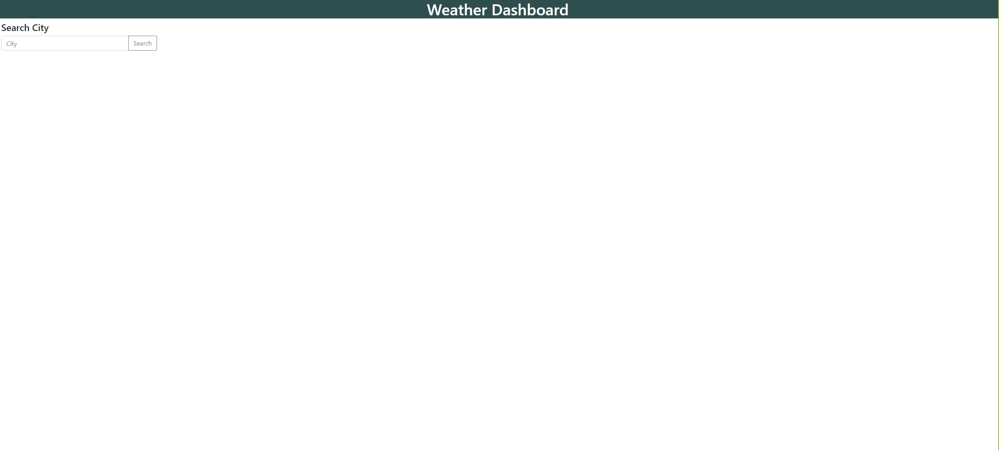

# Weather Dashboard
 

 
### Table of Contents:
* [User Story](##-User-Story)
* [Description](##-Description)
* [Installation](##-Installation)
* [Credits](##-Credits)
* [Contributors](##-Contributors)
* [License](##-License)
 
## Deployed site
[Weather Dashboard](https://enevarez-ops.github.io/weatherDashboard/)

 
## User Story
AS A traveler
I WANT to see the weather outlook for multiple cities
SO THAT I can plan a trip accordingly
 
## Description
This site uses JQuery to dynamically create cards with BootStrap to display current weather and a 5 day forecast. Also storing your search history and displaying it with Local Storage. 
 
## Installation
Run on Default Browser
 
## Contributors
Efrain Nevarez
 
## Credits
HTML, JQuery, BootStrap, OpenWeather API
 
## License
This project is licensed by MIT
